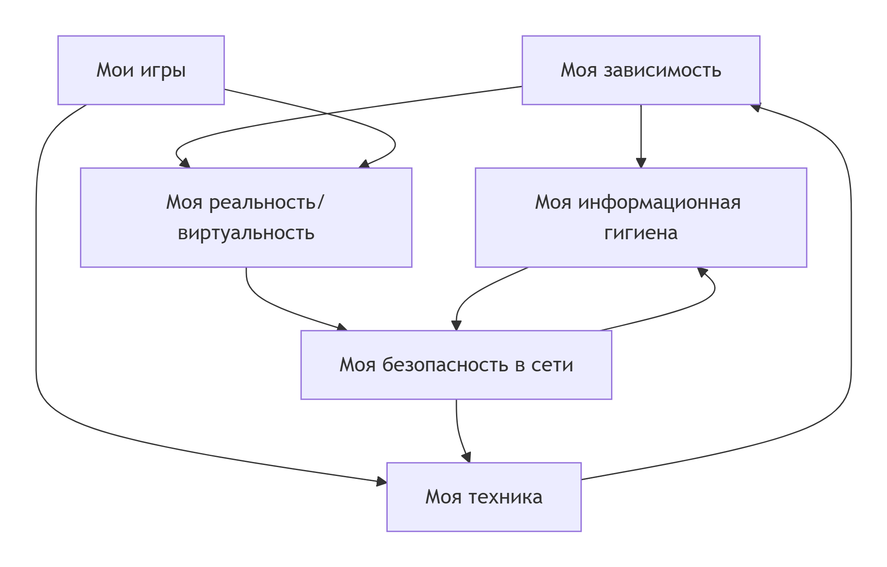

# Отчёт по разделу «Я и цифровой мир»

## Кто работал над разделом

| Роль | Имя | Обязанности |
|------|-----|--------------|
| Капитан | Зауди Яссин | Координация, общая структура, README, финальная проверка, Скрипты|
| Аналитик данных ,Технический редактор| Халалше Хамза Табет Саид | SPARQL-запросы, выгрузка из Wikidata, data, форматирование, проверка ссылок |
| Онтолог ,Автор статей | Альхалаф Касем | Построение схемы связей, concepts.json, ontology.png,Написание всех .md-статей (WEB) |


## Схема связей между подтемами (текстовое описание)

Раздел состоит из 6 блоков, которые сильно пересекаются:

- **Моя зависимость** ↔ **Информационная гигиена** (чем больше скроллишь, тем хуже фильтруешь новости)
- **Мои игры** ↔ **Реальность/виртуальность** (игровая личность влияет на реальную)
- **Безопасность** ↔ **Техника** (настройки приватности зависят от исправности устройств)
- **Информационная гигиена** → **Безопасность** (распознавание фейков снижает риск кибербуллинга)
- **Техника** ↔ **Игры** (апгрейд ПК нужен для киберспорта)



## Примеры SPARQL-запросов

Для каждой подтемы в `scripts/sparql_queries.py` лежит запрос. Один из них (Моя зависимость):

```sparql
SELECT ?countryLabel ?screenTime WHERE {
  ?country wdt:P31 wd:Q6256.
  ?country wdt:P4875 ?screenTime.
  SERVICE wikibase:label { bd:serviceParam wikibase:language "ru". }
}
LIMIT 10